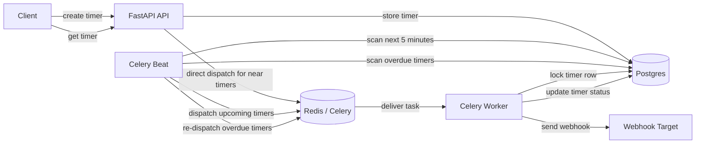
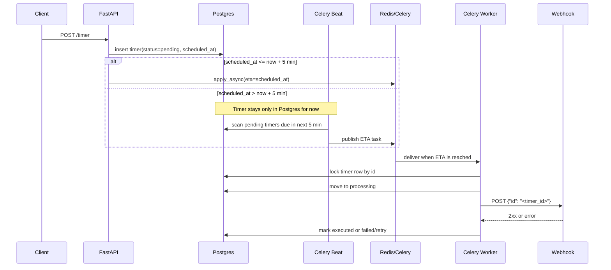
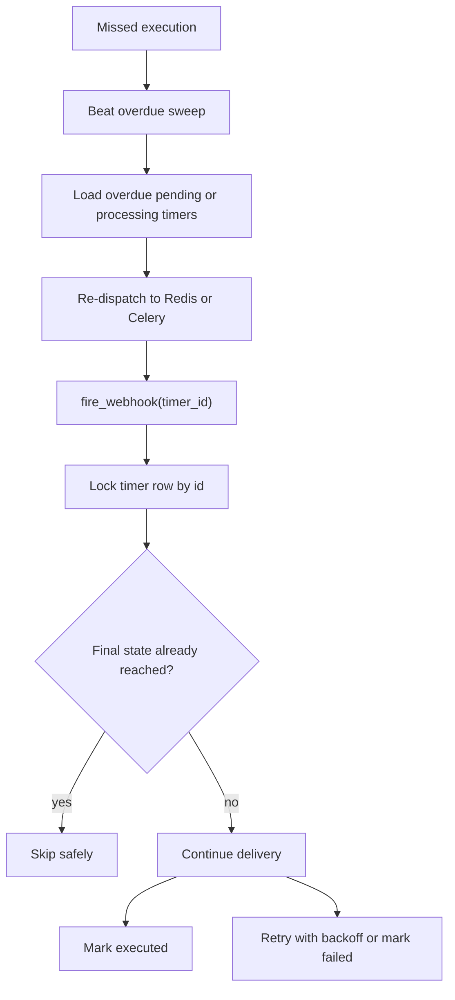

# Solution Design

This document describes a simple, readable design for the timer service based on the current codebase and the assignment.

## 0. Understanding

The problem is not only "delay a webhook". The system must also:

- persist timers durably
- execute them close to their scheduled time
- survive service restarts
- avoid firing the same timer more than once
- scale across multiple API and worker instances

The design used here follows a two-layer scheduling approach:

- Postgres is the source of truth
- Redis/Celery is the execution layer for near-term timers
- a periodic dispatcher scans the database for timers due in the next 5 minutes
- timers already inside that 5-minute window can be sent directly to Redis/Celery
- a separate sweep recovers overdue timers if the broker or worker path misses them

So the system is a two-layer scheduler:

1. durable scheduling in Postgres
2. precise near-term execution in Redis/Celery

## 1. Requirements

### Functional Requirements

1. A client can create a timer with `hours`, `minutes`, `seconds`, and `url`.
2. A client can fetch a timer by id and receive the remaining time.
3. Invalid input must be rejected clearly.
4. The webhook must be fired when the timer becomes due.
5. Timers must survive API, worker, or broker restarts.
6. A timer should be fired once even when multiple workers are running.
7. The service should support horizontal scaling.

### Non-Functional Requirements

1. Writes must be durable.
2. Execution timing should be reasonably accurate.
3. Concurrent workers must not corrupt state.
4. The system should be observable and operable in containers.
5. The design should stay simple enough for an assignment-sized project.

## 2. Core Entity

The core entity is `Timer`.

### Important Fields

- `id`: unique timer identifier
- `url`: webhook target
- `scheduled_at`: exact execution timestamp in UTC
- `dispatched_at`: timestamp set when the timer is first sent to the broker; `NULL` means not yet dispatched
- `status`: lifecycle state
- `attempt_count`: delivery attempt counter
- `last_error`: last delivery failure reason
- `executed_at`: successful execution timestamp
- `failed_at`: final failure timestamp

### State Model

- `pending`: timer is stored and waiting
- `processing`: a worker has claimed the timer
- `executed`: webhook completed successfully
- `failed`: retries are exhausted

### Allowed State Transitions

- `pending -> processing`
- `processing -> processing`
- `processing -> executed`
- `processing -> failed`

This state machine is intentionally small. It is enough to support scheduling, retry, and recovery without over-designing the domain model.

## 3. API / Interface

### External API

#### `POST /timer`

Input:

- `hours`
- `minutes`
- `seconds`
- `url`

Behavior:

- validates the request
- calculates `scheduled_at`
- stores the timer in Postgres
- if the timer is due within the dispatch window, sends it to Celery immediately with `eta=scheduled_at`

Response:

- `id`
- `time_left`

#### `GET /timer/{id}`

Behavior:

- loads the timer from Postgres
- returns the remaining time until `scheduled_at`

Response:

- `id`
- `time_left`

### Internal Worker Interfaces

- `dispatch_upcoming_timers()`: periodic dispatcher for the next 5 minutes
- `sweep_overdue_timers()`: periodic recovery task for overdue work
- `fire_webhook(timer_id)`: final delivery task executed by Celery workers

## 4. Data Flow

### Main Flow

1. Client calls `POST /timer`.
2. FastAPI validates input and computes `scheduled_at = now + delay`.
3. The timer is inserted into Postgres with status `pending` and `dispatched_at = NULL`.
4. If the timer is due within 5 minutes, it is sent directly to Redis/Celery with `eta=scheduled_at` and `dispatched_at` is stamped immediately.
5. If the timer is due later than 5 minutes, it stays only in Postgres for now.
6. Every 5 minutes, `dispatch_upcoming_timers` scans Postgres for `pending` timers with `dispatched_at IS NULL` that are due in the next 5 minutes, publishes them to Redis/Celery with `eta=scheduled_at`, and stamps `dispatched_at`. Timers already dispatched are skipped.
7. When the ETA is reached, a Celery worker runs `fire_webhook(timer_id)`.
8. The worker locks the timer row with `SELECT ... FOR UPDATE`.
9. If the timer is already `executed` or `failed`, the worker skips it.
10. Otherwise, the worker moves it to `processing`, sends the webhook, and finalizes it as `executed` or `failed`.

### Recovery Flow

1. Every 60 seconds, `sweep_overdue_timers` queries overdue timers that are eligible for re-dispatch:
   - `pending` timers whose `scheduled_at` has passed.
   - `processing` timers whose `dispatched_at` is older than the stale threshold (default 120 s), indicating a worker crash.
2. These timers are re-dispatched to Celery and `dispatched_at` is re-stamped.
3. Fresh `processing` timers (dispatched within the last 120 s) are left alone — they are being actively handled by a worker.
4. `fire_webhook` re-checks the current timer state under row lock and only one worker is allowed to continue.

### Simple Diagram 1. System Architecture

### Simple Diagram 2. Create to Execute Flow

## 5. High-level Design

Primary goal in this section: satisfy the functional requirements.

### Component View

- `FastAPI`: request validation and API entrypoints
- `Postgres`: durable timer storage and lifecycle state
- `Redis + Celery`: near-term delayed execution
- `Celery Beat`: periodic dispatch and recovery
- `Celery Worker`: webhook delivery and retry

### Functional Requirement Mapping

#### Create Timer

Requirement:

- the user must be able to create a delayed job

Design:

- `POST /timer` accepts the delay components and webhook URL
- the service converts the delay into one `scheduled_at` timestamp
- the timer is persisted first in Postgres

#### Retrieve Remaining Time

Requirement:

- the user must be able to query a timer and get the remaining time

Design:

- `GET /timer/{id}` reads the timer by primary key
- `time_left` is calculated as `max(0, scheduled_at - now)`

#### Execute at the Right Time

Requirement:

- the webhook should fire when the timer becomes due

Design:

- timers inside the next 5 minutes are sent to Celery with `eta=scheduled_at`
- timers further in the future stay in Postgres until the dispatcher moves them into the near-term execution layer

The key design decision is to avoid pushing all future work into the broker immediately.

#### Survive Restarts

Requirement:

- timers must not disappear if API, worker, or broker restarts

Design:

- Postgres is the durable source of truth
- Redis/Celery is treated as an execution mechanism, not the only storage layer
- Beat periodically re-dispatches missed timers from the database

#### Fire Once

Requirement:

- one timer should not be executed multiple times

Design:

- the worker locks the row before acting on it
- timer state determines whether execution may continue
- final states are terminal and skipped by later deliveries

#### Horizontal Scaling

Requirement:

- the system should work with multiple API or worker instances

Design:

- API instances are stateless and can scale horizontally
- workers compete for tasks safely because the database row lock serializes ownership
- Beat should remain a single logical scheduler instance

## 6. Deep Dive / Low-level Design

Primary goal in this section: satisfy the non-functional requirements.

### Durability and Transaction Boundaries

- The API path uses an async SQLAlchemy session per request.
- Repository methods `flush`; the request boundary owns the commit.
- This keeps transaction ownership in one place and avoids hidden commits in lower layers.
- Postgres remains the system of record for every timer.

### Concurrency Control

- `fire_webhook` loads the timer with `SELECT ... FOR UPDATE`.
- This is the core exactly-once mechanism.
- Only one worker can actively hold the row at a time.
- The overdue sweep uses `skip_locked=True` so concurrent sweep executions do not block each other.
- `dispatched_at` prevents the dispatcher from re-publishing timers that are already in the broker queue.
  The query filters `WHERE dispatched_at IS NULL`, so only genuinely un-dispatched timers are picked up.
- The sweep applies a stale threshold: `processing` timers are only re-dispatched when
  `dispatched_at < now - processing_stale_threshold` (default 120 s), distinguishing a live worker
  from a crashed one.

### Simple Diagram 3. Recovery and Exactly-once

### Retry and Failure Handling

- Webhook delivery uses retry with exponential backoff.
- `attempt_count` and `last_error` give operational visibility.
- After the configured retry limit, the timer is marked `failed`.
- Redirects are followed during webhook delivery to avoid false failures on common `301/302` responses.

### Webhook Idempotency

- Outbound webhooks include a stable `Idempotency-Key` header and an `X-Timer-Id` header, both set to the timer id.
- Those headers stay the same across retries, so the receiver can safely detect duplicates.
- This service coordinates timer ownership and retries, but the external HTTP boundary should still be treated as `at-least-once`.
- If the receiver needs business-level exactly-once behavior, it should store processed event ids in a `processed_events` table with a unique constraint.
- A typical receiver flow is: insert `timer_id` into `processed_events`, execute the side effect on first insert, and return success without repeating work on conflict.

### Timing Model

- All scheduling is based on UTC timestamps.
- Celery `eta` gives near-term precision, but it is not hard real-time.
- The dispatch window keeps the broker focused on work that is close enough to execute soon.
- The overdue sweep bounds recovery delay after failures.

### Validation and Safety

- Input is validated with Pydantic.
- Delay values must be non-negative and below the configured maximum.
- URLs must be valid HTTP/HTTPS URLs.
- localhost, loopback, and private IP literals are blocked to reduce SSRF risk.
- Webhook calls use a bounded timeout.

### Container and Runtime Design

- `backend`, `worker`, and `beat` are separate containers because they have different responsibilities and scaling patterns.
- A dedicated `migrate` container runs Alembic before runtime services start.
- Health checks are defined for infrastructure and application services.
- `init: true` and `stop_grace_period` improve shutdown behavior for Celery workers.

### Why This Low-level Design Fits the Assignment

- It is small enough to understand quickly.
- It still handles the real failure modes expected in backend systems: retries, restarts, duplicate delivery attempts, and multi-worker concurrency.
- It avoids premature complexity such as sharding, custom schedulers, or event sourcing.

## 7. Future Design

If this service had to evolve beyond the assignment, these would be the next improvements.

### Reliability

- For a higher-traffic production system, replace the direct `apply_async` calls with a transactional outbox:
  write dispatch intent to an `outbox` table in the same DB transaction as the timer state change,
  then relay to the broker asynchronously. This eliminates the DB/broker dual-write entirely.
- Add dead-letter handling for permanently failing webhook targets.
- Consider Redis Sentinel, Kafka, RabbitMQ, or SQS for stronger broker availability guarantees.

### Scale

- Add PgBouncer in front of Postgres.
- Partition the `timers` table by `scheduled_at` for very large datasets.
- Add archival/cleanup for old `executed` and `failed` timers.
- Auto-scale workers based on queue depth.

### Data Model Evolution

- Keep the current single `timers` table for the assignment because it is simpler and easier to reason about.
- If richer auditability is needed later, add a separate `timer_executions` or `webhook_attempts` table.
- That future table can store one row per delivery attempt, including retry number, worker start time, finish time, HTTP status, latency, and failure reason.
- In that model, `timers` remains the current state snapshot, while the executions table becomes the full delivery history.

### Observability

- Add metrics for timer creation rate, dispatch lag, execution latency, retry count, and failure rate.
- Add structured tracing across API, dispatcher, worker, and outbound webhook calls.

### API and Product Evolution

- Return full timer status in `GET /timer/{id}`, not only `time_left`.
- Support cancellation if the timer is still `pending`.
- Add authentication, rate limiting, and per-tenant quotas.

### Scheduling Evolution

- If the timer volume becomes very large, move Beat scheduling ownership to a more explicit singleton or leadership-based scheduler.
- If precision or durability requirements become stricter, replace broker ETA scheduling with a dedicated delayed-queue product or cloud scheduler.
